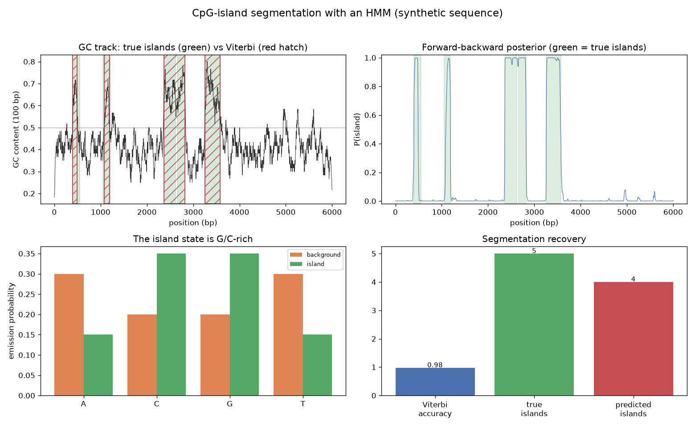

# Hidden Markov Model: CpG-Island Segmentation

A genome is a string of four letters, but hidden underneath is a sequence of *states* — coding vs non-coding, island vs background, one chromatin mark vs another — that you never observe directly. The Hidden Markov Model is the workhorse for recovering those hidden states from the letters you can see, and this project builds its two core algorithms, Viterbi and forward-backward, from scratch to find CpG islands.

## Demo Output



Produced entirely from a simulated 6,000-base sequence by `demo.py` — no downloads. The model recovers the hidden island regions it was never shown.

## Why This Exists

CpG islands — short G/C-rich stretches near gene promoters — matter because their methylation state controls transcription. But "G/C-rich" is fuzzy: how rich, over how long a window, before you call it an island? An HMM answers this principledly. It posits two hidden states, background and island, each emitting nucleotides with different probabilities (the island state favours G and C), and a transition structure that makes states *sticky* so islands come in contiguous blocks. Given only the observed sequence, the model infers where the hidden states switch.

Two classic algorithms do the inference, and both are here in full:

- **Viterbi** finds the single most-likely path of hidden states through the whole sequence — the maximum-likelihood segmentation. It is dynamic programming in log space, and it is exactly how gene finders and chromatin-state callers draw their boundaries.
- **Forward-backward** computes, for every base, the *posterior probability* of being in each state given the entire sequence. Where Viterbi gives a hard call, forward-backward gives calibrated uncertainty — a probability that rises smoothly into an island and falls out of it.

The same machinery powers ChromHMM, gene-prediction tools, and copy-number segmenters; CpG islands are just the cleanest way to see it work.

## How It Works

1. **Define the model.** Two states with G/C-biased vs A/T-biased emission probabilities and sticky transitions.
2. **Simulate a sequence** by walking the Markov chain and emitting bases — giving a ground truth to check against.
3. **Run Viterbi** for the most-likely segmentation and **forward-backward** for the per-base island posterior.
4. **Compare** the recovered islands and posterior against the truth, and read the emission probabilities that define each state.

## When NOT to Use This

This two-state, single-nucleotide HMM is a teaching model. Real CpG-island detection uses the *dinucleotide* CpG depletion signal (not just GC content) and often more states; gene finders add dozens of states for exons, introns, and splice sites. HMMs also assume the current state depends only on the previous one — a first-order Markov assumption that misses longer-range dependencies, which is where modern segmenters and neural models take over.

## The Uncomfortable Truth

It is easy to slide a GC-content window along a genome, eyeball the bumps, and draw island boundaries by hand. That threshold is arbitrary and irreproducible. An HMM replaces the eyeball with a probabilistic model whose boundaries fall out of the data and whose posterior tells you exactly how confident each call is. If your segmentation matters, do not draw the lines with a ruler.

## Run It

```bash
pip install -r requirements.txt
python demo.py
```

`hmm.py` provides `viterbi`, `forward_backward`, and `simulate` — a complete, reusable discrete HMM.

## Further Reading

Inspired by the HMM and sequence-analysis chapters of *Computational Genomics with R* (Altuna Akalin, https://compgenomr.github.io/book/). The classic reference is Durbin, Eddy, Krogh & Mitchison, *Biological Sequence Analysis* (1998).

> Demonstrated on a synthetic sequence, so the whole thing is reproducible with no external downloads.
